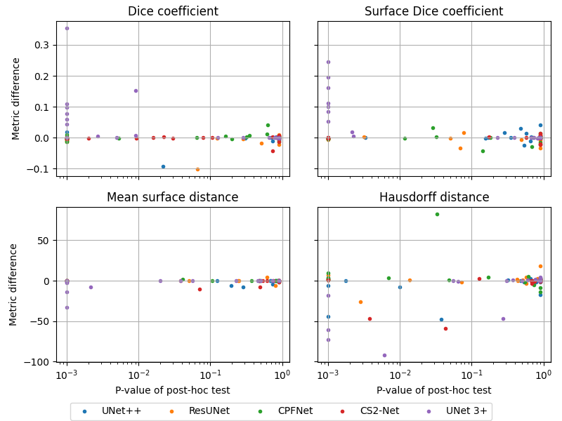

# Benchmark of deep architectures for segmentation of medical images

The repository contains the source code used for evaluation of UNet-based [1] deep neural network models used for medical image segmentation with use of nnUnet framework [2]. Following architectures were reimplemented and compared with basic version of Unet: UNet++ [3], UNet3+ [4], ResUnet [5], CPFNet [6] and CS2-Net [7].

## How to run
0. Make sure to have [nnUnet](https://github.com/MIC-DKFZ/nnUNet) installed and configured properly.
1. Code for each model is run separately and training/prediction scripts are provided in adequate directories.
2. Change workdir and other paths in run_training.py script.
3. Run training with:
```bash
python3 run_training.py TASK_NAME_OR_ID FOLD_NO
```
4. Run predictions with:
```bash
python3 predict_simple.py -i path/to/test/images -o path/to/results/directory -tr trainerName -m 2d -p nnUNetPlansv2.1 -t taskName -chk model_best
```

## Data
All datasets used for comparison are avilable in public domain:
* [task 1](https://data.mendeley.com/datasets/zm6bxzhmfz)
* [task 2](https://data.mendeley.com/datasets/6x684vg2bg)
* [task 3](https://www.kaggle.com/krzysztofrzecki/bone-marrow-oedema-data)
* [task 4, 5, 6](http://medicaldecathlon.com/)
* [task 7](https://wiki.cancerimagingarchive.net/display/Public/LIDC-IDRI)
* [task 8](https://www.kaggle.com/c/data-science-bowl-2018/data)
* [task 9](https://competitions.codalab.org/competitions/17094)

## Metrics
Metrics that were used for evaluation of performance of trained models:
1. The number of trainable parameters
2. Training time
3. Prediction time
4. Sørensen–Dice coefficient
5. Surface Dice coefficient
6. Mean surface distance
7. Hausdorff distance

Metrics 4-7 were calculated using [surface-distance package](https://github.com/deepmind/surface-distance).

Friedman test was used to test whether there is a difference between the segmentation quality measures computed for the six different architectures. The assumed significance level was equal to 0.05. Whenever the Friedman test indicated a statistically significant difference between models, Nemenyi post hoc tests were run to discover differences between models on a pair-wise basis. We implemented statistical testing procedures in Python using [scipy.stats](https://docs.scipy.org/doc/scipy/reference/stats.html) and [scikit-posthocs](https://scikit-posthocs.readthedocs.io/en/latest/posthocs_api/) packages.

## Results
The results are visualized on the graph below.


The differences between quality metrics for simple U-Net and the competing architectures plotted against the p-values of post hoc tests. Positive values of differences for Dice coefficient or surface Dice coefficient for some architecture mean that the performance of this architecture was worse than that of U-Net in terms of either Dice coefficient or surface Dice coefficient. Analogously, negative values of differences for mean surface distance or Hausdorff distance for some architecture mean that the performance of this architecture was worse than that of U-Net in terms of either mean surface distance of Hausdorff distance. Clearly, there is no systematic pattern in the figure, that is, neither architecture is consistently better nor worse than U-Net. If some architecture is better than U-Net in some task, it is worse in other tasks. Moreover, even if some architecture is better in terms of some metric than U-Net, the difference in the quality metric may be of no domain significance.

Detailed results can be found [here](Results/detailed_results.md) 

## Submitting your algorithm for benchmark 
We encourage authors of new promising architectures to compare their implementations and submit it to be included in our benchmark. To do so:
1. Adapt your solution to nnUNet environment (see [Use a different network architecture](https://github.com/MIC-DKFZ/nnUNet/blob/master/documentation/extending_nnunet.md#use-a-different-network-architecture) in nnUNet docs for more info).
2. Train the models and calculate benchmark metrics for each task. 
3. Add all the necessary code to a new directory in the benchmark repository using Pull Request. Please provide summary of the obtained results and any additional information that may be useful.
4. Your results will be verified and the architecture will be added to the benchmark.

## References
1. Ronneberger O., Fischer P., Brox T. (2015) U-Net: Convolutional Networks for Biomedical Image Segmentation. In: Navab N., Hornegger J., Wells W., Frangi A. (eds) Medical Image Computing and Computer-Assisted Intervention – MICCAI 2015. MICCAI 2015. Lecture Notes in Computer Science, vol 9351. Springer, Cham. https://doi.org/10.1007/978-3-319-24574-4_28
2. Isensee, F., Jaeger, P.F., Kohl, S.A.A. et al. nnU-Net: a self-configuring method for deep learning-based biomedical image segmentation. Nat Methods 18, 203–211 (2021). https://doi.org/10.1038/s41592-020-01008-z'
3. Zhou Z., Rahman Siddiquee M.M., Tajbakhsh N., Liang J. (2018) UNet++: A Nested U-Net Architecture for Medical Image Segmentation. In: Stoyanov D. et al. (eds) Deep Learning in Medical Image Analysis and Multimodal Learning for Clinical Decision Support. DLMIA 2018, ML-CDS 2018. Lecture Notes in Computer Science, vol 11045. Springer, Cham. https://doi.org/10.1007/978-3-030-00889-5_1
4. Huang, Huimin & Lin, Lanfen & Tong, Ruofeng & Hu, Hongjie & Qiaowei, Zhang & Iwamoto, Yutaro & Han, Xian-Hua & Chen, Yen-Wei & Wu, Jian. (2020). UNet 3+: A Full-Scale Connected UNet for Medical Image Segmentation. 1055-1059. 10.1109/ICASSP40776.2020.9053405
5. Foivos I. Diakogiannis, François Waldner, Peter Caccetta, Chen Wu, ResUNet-a: A deep learning framework for semantic segmentation of remotely sensed data,
ISPRS Journal of Photogrammetry and Remote Sensing, Volume 162, 2020, Pages 94-114, https://doi.org/10.1016/j.isprsjprs.2020.01.013
6. S. Feng et al., "CPFNet: Context Pyramid Fusion Network for Medical Image Segmentation," in IEEE Transactions on Medical Imaging, vol. 39, no. 10, pp. 3008-3018, Oct. 2020, doi: 10.1109/TMI.2020.2983721.
7. Lei Mou, Yitian Zhao, Huazhu Fu, Yonghuai Liu, Jun Cheng, Yalin Zheng, Pan Su, Jianlong Yang, Li Chen, Alejandro F. Frangi, Masahiro Akiba, Jiang Liu, CS2-Net: Deep learning segmentation of curvilinear structures in medical imaging, Medical Image Analysis, Volume 67, 2021, 101874,https://doi.org/10.1016/j.media.2020.101874
